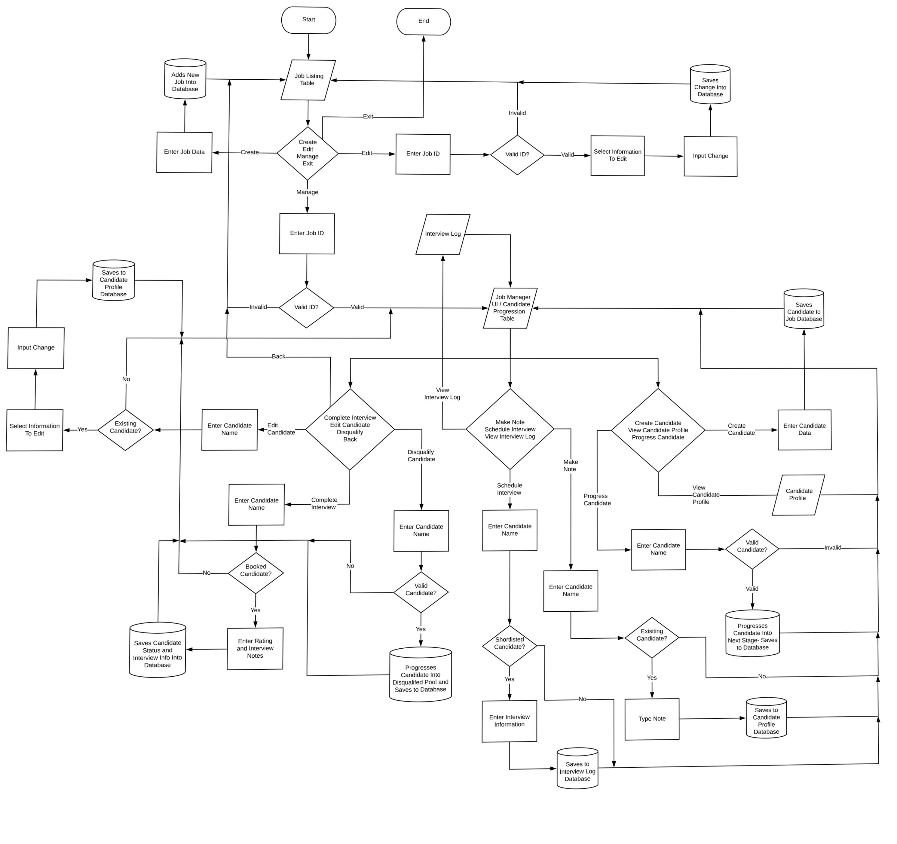

# Software Development Plan
### For **terminalHRM**

#### Caleb Leung - 10.11.19


## **Statement of Purpose and Scope**

```terminalHRM``` is a terminal application software that provides a Human Resource Management solution for businesses of all sizes. ```terminalHRM``` will be all open source for the market (our class) to contribute and use freely. 

The application will aim to have the ability to open a job request, receive incoming applications, sort and manage candidates throughout the recruitment process, and have useful user tools at each step. 

Human resource management is essential for any business attempting to scale and grow, and is integrated in everything the business does. People make up the business, and well managed people allow for a well run business. Businesses that have little to no human resource management, or ones that choose to ignore it may find it coupable in early stage scaling, however when employee numbers grow, payroll accountabilities grow, workflow scope changes, without a well integrated system that keeps all these aspects interconnected, the business will suffer short term inefficiencies, and long term sustainability is very unlikely. 

```terminalHRM``` has three clearly defined goals for development.

1. To make HRM easy and understandable for all levels of employees in the company
2. To simplify the end to end recruitment process into clearly defined stages
3. To provide meaningful information that the business can leverage to find opportunities for improvement across all areas. 

```terminalHRM```'s target audience include businesses of all sizes, in all industries, who are looking to grow their workforce with an easy, free, user-friendly solution to manage the process. 

Businesses without a current HRM solution will be a key target audience. ```terminalHRM``` provides a very introductory solution that they can try out and use indefinitely, that also is competitive and complete with all the features of large enterprise HRMs however who can provide on the fly, tailored features for clients due to being open source.  

Ones that have a current solution still show large opportunities for targeting, as ```terminalHRM``` will provide a financially better alternative and a software that is easier to utilise and simpler to understand with less complexities when compared to solutions that are hard to understand, higher barriers to learn, and causes user paralysis with too many unnecessary features. 

<br>

## **List of Features**

1. **Manage job opportunities**. The software will have a feature to manage multiple job opportunities, and provide a high-level overview of all current opportunities in the business. The software will also allow the user to manage the recruitment process of each opportunity separately.  

2. **Receive, record applications**. Within each job opportunity, the software will provide multiple features to- record candidate applications, view each candidate’s profile, see relevant details, edit these if necessary, and provide useful information reports on total applications, type of applicants, days live for the job posting etc. 

3. **To select and shortlist potential candidates**. This feature will also allow the user go through each candidate’s profile and shortlist them to the next stage if they have potential. Then from here, a user can schedule an interview with each shortlisted candidate. Once interviews are completed a user can then provide comments, feedback, and a rating of each. 

4. **Extend an offer**. The software will allow the user to select and offer successful candidates. From here the user can either close off the job opportunity if all the openings are filled, or continue to recruit for the roles, storing successful candidates in a completed pool.

<br>

## **User Interaction and Experience**

### **Starting the Application**

1. Upon starting ```terminalHRM``` for the first time, the user will be prompted to enter their Company's details- in which then it will bring them straight to the job listing UI. 
2. If returning user, the application will load the job listing UI straight in displaying the User's saved company details at the top

### **Jobs Overview Level**
3. Here the UI will display current open job opportunities for the user to see
4. At the bottom of the inferface, there will be options for the user to choose from- using directional keys to select
5. If there are no current job openings, a user can select the create option to enter job details and create an opening to manage later
6. If there are existing job openings, a user can choose to edit the displayed details if something with the opportunity changes, if there is an error, or to set the job status to close if the recruitment process is finished
7. From here a user can also choose to exit and close the program
8. Next a user can select a job to manage with the 'manage' option, inputting the job ID they wish to manage

### **Job Management Level**
9. Going into a specific job to manage, a new UI will display the job's details at the top, and a candidate progression table below
10. Underneath the candidate table a similar menu using directional keys will let the user choose what to manage. 
11. Important features to note here are the "Create Candidate" option, "Edit Candidate" option, and "View Candidate profile" option- these options will display an input field if creating or editing, or the candidate's information below the menu display if viewing. 
12. A user can choose to "Make a Note" on a candidate in which it will bring up an input field for the user to type the candidates name, and associated note.
13. The "Progress Candidate" option will move the candidate to the next pool if applicable.
14. A user can choose to "Schedule an Interview" for a shortlisted candidate in which it will display an input field below the menu to enter interview details
15. These details will be logged into the interview log which the user can see with the "Interview Log" option
16. A user can choose to disqualify a candidate with the "Disqualify Candidate" option which will move the candidate into the disqualified column and prompt a user to note a reason which will be recorded in the candidate's profile notes
17. The "Back" option will take the user back into the job listing UI

### **Error Handling**
Error handling throughout ```terminalHRM``` will be done so at each user input stage when a user types a job ID or candidate name to action upon. 

If an invalid ID is typed in, the application will throw a simple "Invalid ID Error" message and prompt the user to press Enter to return back to the menu.

For candidates:
* User input is case insentive when entering a candidate's name
* If a non-existent candidate name is entered in, the application will throw a simple "Invalid/Non-existing Candidate Error" message and prompt the user to press Enter to return back to the job management menu
* If a user tries to book an interview in with candidates not in the shortlist a "Candidate must be in shortlist stage" message will show prompting the user to return back to menu
* If a user tries to progress a candidate pass the shortlisting stage without booking an interview- the application will throw a "Candidate must be booked in for an interview" error message and usual prompt back to menu
* If a user tries to progress a candidate at interview stage without marking the interview complete a "Interview must be completed before sending offer" message will show prompting user to return back to menu

Error handling when the application is initialising and loading jobs/candidates when executing will throw a simple "Failed to load database" message, not loading the application.

<br>

## **Control Flow Diagram**

Below is a control flow diagram explaining the experience flow for a typical user. 

Find a PDF with the same diagram for easier viewing in ./docs.




