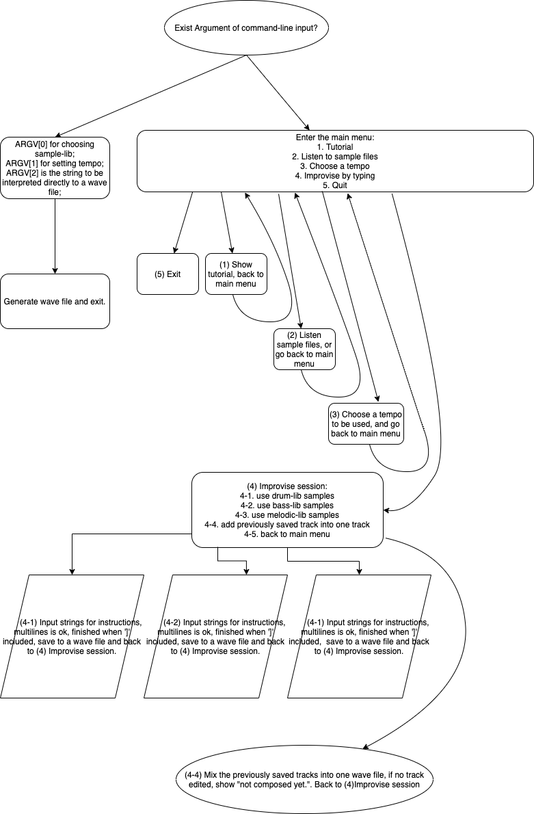

<h1>Improvise Freestyle</h1>


# Purpose and Scope

The purpose of this project is to create a simplified process of musical improvisation and composition, as well as musical education and related fields of entertainment. 

Inspiration came from the expensiveness and uneasiness we felt for current musical tools. 

Players of this program could experiment ideas by typing. Only the effective key which could be mapped to a certain instruction is kept in the sequence that converts to wave file of track. Tracks could be added to create multi-tracks result.

Potential users could be anyone, ex. kid/adult/student/educator/musician/gamer who would like to experiment with music. 

For musicians, musical ideas could be written as text of sentences, which map to instructions of writing notes.  Although current version only includes 3 samples for a track, it could be easily expanded. (ex. to all 12 semi-tones of an instrument) Please do not expect this project to replace other tools such as DAW, it's only for the purpose of simplified experiment.

# Features

## Text to Music

Transform your keyboard into a music instrument, it could be a simplified simulation of any instrument if samples provided, or a imaginary instrument of map from key to sample, listen to your ideas just by typing text.

## Check the Sequence of Instructions after Input

Each sentence comes with feedback of the instructions you created, try-and-error could be enjoyable process of refinement.

## Stylize with Your Choice of Samples

Substitute sample files and create your own library of instruments.

## Simple Key Scheme

Start with 3 samples (key 's','d','f') per track,
adjusting duration of note(key 'y','u','i','o','p' for 1,1/2,1/4,1/8,1/16 beat, key 'h','j','k' for 1/3,1/6,1/12 beat),
rest with key '-',
That's all!
Other key doesn't make change to the instructions. For readabilty, for example, we could use space to make words of sentence clear.

# User Interaction

## Choose from Menu

User navigates by menu to the option interested.

## Tutorial included

Choose Tutorial anytime in the main menu for definition of key-mapping.

## Compose with Text at will

In the 'Improvise' session, type freely until Exit-Key ']' included. No key is wrong, only effective keys to be mapped to instructions are
interpretted.

## Use command-line option to directly Generate a Track

If you want to generate a track without entering the menu, append first argument 1|2|3 as the sample library to use, second argument as the tempo in bpm, third argument is the text to be interpreted to a wave file. For example, command below generate a drum track at 100 bpm.
```bash
ruby main.rb 1 100 s-ssd-ddf-ff
```

# System Requirements

* This version is designed for MacOS system, using afplay media-player to play wave files. Audio hardware should work to play sound.

* Tested in Ruby 2.7.0, using gems wavefile, colorize, tty-font, tty-prompt and their dependency. To avoid confliction of MacOS's internal Ruby code, you need Homebrew and rbenv to setup updated Ruby enviroment.

# Installation


## System Requirements:
1. MacOS with terminal and afplay media player.
2. Working audio hardware to play sound.

## Install Homebrew:
Run the commands below in terminal:


```bash
/usr/bin/ruby -e "$(curl -fsSL https://raw.githubusercontent.com/Homebrew/install/master/install)"

brew analytics off

brew update

brew tap caskroom/cask
```
## Install rbenv:

Run the commands below in terminal:
```bash
brew install rbenv
rbenv
```
Close terminal for changes to take effect.

## Install Ruby:
Run the commands below in terminal:
```bash
rbenv install 2.7.0
```

## Install dependency of this program (gems):
Use Gemfile included with bundle:
```bash
bundle install
```


Or run the commands below in terminal:
```bash
gem install colorize
gem install tty-font
gem install tty-prompt
gem install wavefile
```

## Download source code from github:
<a href="https://github.com/bcehmu/improv-freestyle/archive/master.zip">Source Code : improv-freestyle</a>

Extract to a loal folder where you enter for running the program. 
Run the command below in terminal after entering the folder:
```bash
ruby main.rb
```

## To customize samples, replace any wav files in the folders below:
\audio-samples\lib-drum\

\audio-samples\lib-drum\

\audio-samples\lib-melodic\

* files should be named sample1.wav or sample2.wav or sample3.wav
* files should be of format wav, (44100HZ, PCM 16 bits, stereo)


# Source Repository

<a href="https://github.com/bcehmu/improv-freestyle">GitHub repository of this project
</a>

# Reference


Ruby Gems used:

<a href="https://wavefilegem.com/">wavefile
</a>

<a href="https://rubygems.org/gems/colorize">colorize
</a>


<a href="https://rubygems.org/gems/tty-prompt">tty-prompt
</a>

<a href="https://rubygems.org/gems/tty-font">tty-font
</a>

Online free samples:

<a href="https://freewavesamples.com/">freewavesamples.com
</a>

# Control Flow



# Trello Link

<a href="https://trello.com/b/TWs7MOic/improvfreestyle">Trello board
</a>

