# Battle Ships RB - Software Development Plan 
## Statement of Purpose and Scope 
Battle Ships RB will be a terminal application game similar to the classic board game Battleships. The game involves two players, each having their own grid like playing board. Both players have a certain number of ships that are plotted onto their own respective playing grid. While each player knows the location of their own ships, the location of their opponent’s ships are a mystery. The players then take it in turn to try and guess the location of the other player’s ships using coordinates to strike an attack. The first player that successfully locates all of the other player’s ships wins. 

The features of Battle Ships will consist of: 

>1. Personalised character names; 
>2. Game board grids generated for each player; 
>3. Each user has five ships randomly placed placed on their game board grid; 
>4. Users can view their own game board grid and the location of their previous attacks before launching an attack; and
>5. Attack function based on coordinates input by the users. 

The purpose of Battle Ships RB is to take a classic, widely known and enjoyed board game and digitally revamp to make it more accessible to a wider demographic of people. The board game version involves physical playing pieces that requires the players to set up, manually move each turn and store securely after playing. If any of the ships, location indicator pins or board pieces are lost the game is rendered unplayable. Additionally, the physical game may not be suitable for younger children as the small pieces could potentially be a choking hazard. These problems are solved by creating a digital version that can be enjoyed easily and safely by people of all ages. A digital version can be played an infinite amount of times without the risk of losing game pieces, the game physical deteriorating or safety concerns involving young children. 

As an application that will be created primarily for entertainment, Battle Ships RB is designed to appeal to a broad target audience, being both genders, from the ages of 5 and up. The game rules and presentation will be designed in a simple, easy to understand way so that the game can be accessible to people with varying degrees of technological ability. Similarly, the use of bright colours, non-offensive graphics and engaging game play will make it appealing to both younger and older generations alike. The storyline and language used will also be appropriate for young children. 

## Development of Features 

1. Upon commencing the application and selecting the option to play a game, each player will be prompted to enter a character name. To achieve this, a Player class will be created. A ‘puts’ will be displayed to the screen and the subsequent user input will be saved to a variable. A new instance of the Player class will then be created with this variable being passed in as an argument. The user’s character name will then be stored in the instance of the Player class as an instance variable. (*Included after testing - An until loop will be used to continue to prompt the user to enter a character name until their character name is less than 20 characters in length*)

2. After each user has entered their respective character names, the application will generate a game board for each player that is a 10x10 grid with the numbers 1 to 10 running along the x-axis, and the letters A to J down the y-axis. To achieve this, a Board class will be created that includes a class method that will generate a hash. The keys of the hash will be strings containing the letter for each row. Each value will be an array with a tilde symbol as a string occupying each index. The only exception will be the first key value pair (to represent the x-axis), in which the key will be a “0” and the value will be an array with each index being a number from 1-10 as a string. A different instance of the Board class will be created for each player.

3. The game will generate five ships for each user. This will be accomplished using a Ship class as well as class methods within the Board class. The Ship class will contain instance variables of the ship’s length and its orientation, either horizontal or vertical. A class method within the Ship class will randomly generate the coordinates on which the ship will be placed on the game board grid, ensuring the ship does not extend beyond the boundaries of the grip and that it is not placed on a coordinate that is already occupied by another ship. For each ship, a new instance of the Ship class will be created. A class method within the Board class will then take in the ship’s instance variables and will change the designated coordinates on the respective player’s game board to an “S” to represent the ship.

4. Each player will be be able to choose to view their own game board with the location of their own ships before the game commences. This will be accomplished by a class method from the Board class that draws the player’s board to the screen with their respective ships. The player will also be able to view the location of their previous attacks. To do this, a “puts” will be displayed showing a menu that includes the option to view their own game board or their previous attacks. An if/else statement will be created to handle the user selection. If the integer that corresponds to the view board option, the same Board class method will be called to display the player’s game board and the status of their ships.

5. Each player can also choose to launch an ‘attack’ on a specific location on their opponent’s game board. This will occur through a “puts” asking the player to enter their coordinates. The input will then be chomped and saved to a variable. This variable will then be passed to a Board class method as an argument. The class method will compare the coordinate to the opponent’s ship locations and then utilise an if/else statement. If the user inputs a coordinate that corresponds to the opponent’s ship, then the method will change the index in the array of the game board to an “X”. Else, if the attack coordinate is not an opponent’s ship, it will change the index to an “O”. (*Included after testing - An error was identified that caused the application to crash if a number was entered or a lower case letter was entered as the first coordinate. This was handled in two different ways. If a lower case letter is entered as the first coordinate, the letter is now automatically capitalized. If any combination of characters is entered that does not conform to the letter/number combination, an additional elsif statement has been included that informs the user that their coordinates were invalid. This results in a missed opportunity to attack on the current turn*).  

## User Interaction and Experience 

When the application is run, the user will be presented with a title screen. A main menu will then be displayed to the screen to either begin a game or quit the application. Each option will be displayed next to a specific number that the user is required to input in order to make their selection. To handle any errors that may occur due to incorrect input, this menu will continue to be displayed to the screen until the user enters a valid integer corresponding to an existing menu option. 

From the main menu, if the user selects to begin a game, the first user will be prompted to enter a character name. This is how the user will know how to enter their character name. (*Included after testing - An error was identified after the testing of this feature. The user was able to create a character name that was an infinite amount of characters in length. This clogged up the screen and made all menus and subsequent prompts difficult to read. The error was handled by restricting the user to entering a character name that has a maximum length of 20 characters. If a character name is inputted that is longer than 20 characters, a message will be displayed telling the user to input a shorter character name)*

Once the first user has entered a character name, a message will tell the first user that their ships are being generated and the location of their ships will be displayed to the screen. This will also include a warning for the second user not to view the first user’s game board grid. The game board grid will then be displayed on the screen. 

After the first user’s game board is cleared from the screen, the same process for setting up the second user’s features will commence. Like the first user, the second user will be prompted to enter their character name. A warning to the first user to not view the second user’s game board will then be displayed before the second user is shown their own game board grid with the location of their ships. 

The first user and the second user will take it turn by turn. When it is the beginning of either player’s turn, a message on the screen will indicate as such. A turn menu will be displayed that contains three options, either to view the current user’s own game board grid showing the the status of their own ships,view their previous attacks or to launch an attack on the opponent’s ships. The user will know to enter their selection using an integer, as represented next to each option in the menu. Again, to handle any errors that may occur due to incorrect input, this menu will continue to be displayed to the screen until the user enters a valid integer corresponding to an existing menu option. 

Once the current user selects the option to launch an attack, their opponent's game board grid will be displayed to the screen. This game board will not show the location of the opponent’s ships, but will show any part of an opponent’s ship that has previously been hit by the current user. This game board will also display to the current user their previously guessed coordinates that did not result in a hit. A message will then prompt the current user to enter a letter, between “A” to “J”, and a number, between “1” to “10”, as the coordinates on which they wish to launch an attack. (*Included after testing - The player has been instructed on how to enter valid coordinates. If the user enters invalid coordinates, a message will be displayed informing the user that their invalid coordinates have resulted in a misfire. Their turn will end without a successful attempt for an attack*) Once the coordinates are entered, the opponent's game board will again be displayed to the screen with an updated indication of whether the attack resulted in a hit or a miss. The screen is then be cleared and the turn menu will be displayed along with a message indicating that it is now the next player’s turn. 

When either player launches an attack that hits their opponent’ ship and this is the last remaining coordinate that contains an opponent’s ship, the game will end. The screen will clear and a message will be displayed indicating which user has won the game. A menu will also appear prompting the user to select whether they wish to play again, or quit the game. The selection will be made by entering an integer as indicated next to each menu item. If the user selects to play again, the game will commence from the character input screen. If the user selects to quit, the application will terminate.  

## Control Flow Diagram 

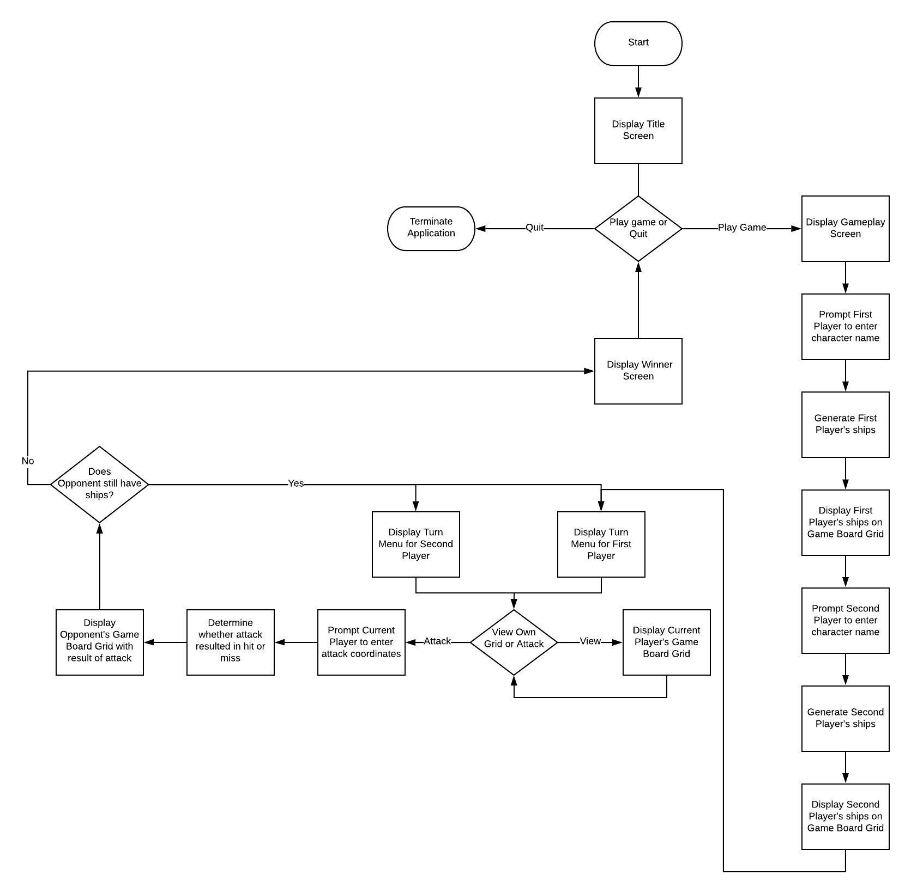 

## Testing of Application Features 

### Testing - Character Name Feature 
The character name feature is the first interaction the user has with the application. It is important that the user is able to enter a recognisable character name so that they are able to follow clear instructions when asked to do so. It is anticipated that a user will enter a simple and recognisable character name. This test will check the results of a variety of different inputs made by the user:

- User enters a single name consisting of letter characters (1-15 in length):
> Result: The application runs smoothly, with the character name neatly interpolated into subsequent prompts making them clearly visible to read. 

- User enters two names consisting of letter characters (1-20 in length):
> Result: The application runs smoothly, with the character name neatly interpolated into subsequent prompts making them clearly visible to read. 

- User enters a single name consisting of letter and number characters (1-20 in length):

> Result: The application runs, although the numbers in the character name may be confusing when appearing near other subsequent prompts that include numbers. 

- User enters a significant name consisting of letters and numbers (50+ in length):

> Result: The application continues to run. However, the subsequent interpolation of the characters name occupies multiples lines of the terminal screen.

The conclusion of the test is that no errors will occur if the user inputs an unexpected character name. However, if the input is greater than 20 characters, the character name is overbearing making the subsequent prompts difficult to read. Additional source code should be implemented to restrict the user to entering a character name of letters and numbers between 1-20 characters in length. 

### Testing - Attack Feature 

The Attack Feature is integral to the proper functioning of the application. The user is prompted to enter coordinates for an attack of their opponent’s game board grid. It is anticipated that the user will enter one letter (“A”), and one number (“4”). This should result in a successful attack with the coordinate index being changed on the opponent’s game board grid.  However, it is anticipated that the input of the user may vary, whether it be mistakenly or intentional.  This test will check the results of a variety of different inputs made by the user. 

- User first enters a letter (“A”) followed by a number (“4”):
>Result: Feature works as expected. The coordinate is plotted as either a hit or a miss on the opponent’s game board grid. 
- User first enters a letter (“A”) followed by another letter (“B”):
> Result: The application continues to run but does not plot any changes on the opponent’s game board grid. 
- User first enters a number (“1”) followed by another number (“2”):
> Result: The application crashes immediately and exits. A Type Error reading “no implicit conversion of String into Integer” is displayed to the screen. 
- User first enters a number (“1”) followed by a letter (“A”): 
> Result: The application crashes immediately and exits. A Type Error reading “no implicit conversion of String into Integer” is displayed to the screen. 
- User first enter a lower case letter (“a”) followed by a number (“4”):
> Result: The application crashes immediately and exits. A Type Error reading “no implicit conversion of String into Integer” is displayed to the screen. 

The conclusion of the test is that the application will crash from a Type Error if another other than a capitalised letter is entered first. The application will continue to run if a capitalized letter is entered first followed by other unexpected characters. However, although this continues to run, it is not functional as no coordinates are plotted on the opponent's game board grid as a result. Changes to the source code are necessary to rectify the Type Errors if unexpected characters are input. 

## Developer Operations 
### Git Hub
A Git Hub repository was initialized and titled appropriately. The project files were regularly committed to Git Hub throughout the development process. 

### Project Management Platform - Trello Board  

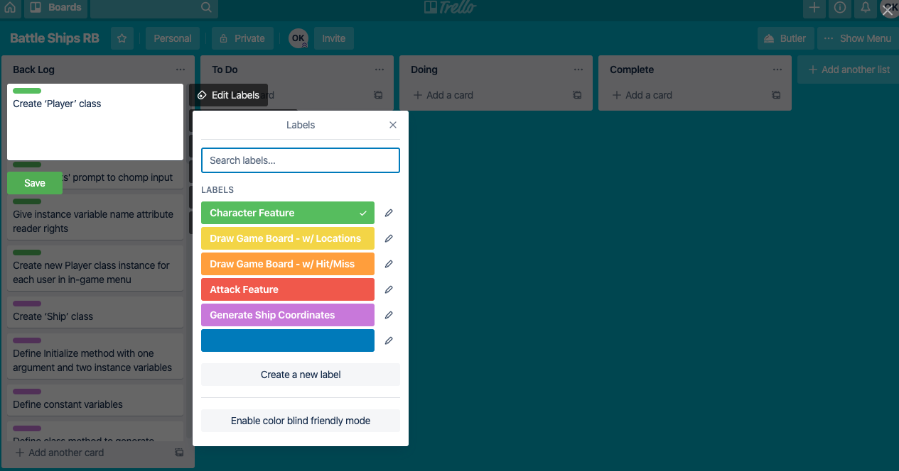
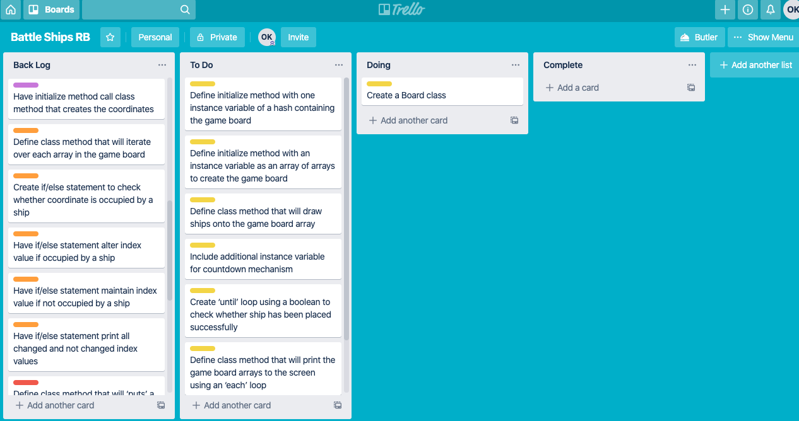
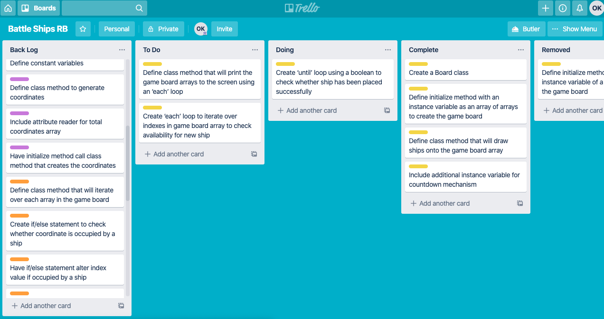
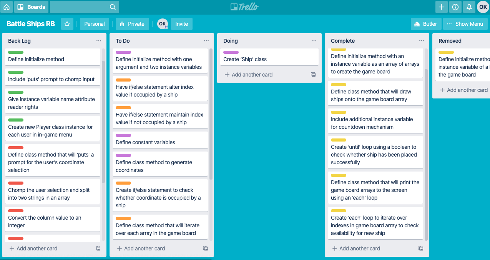
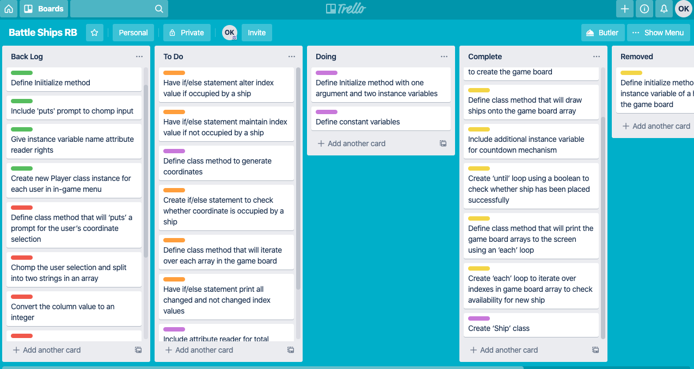
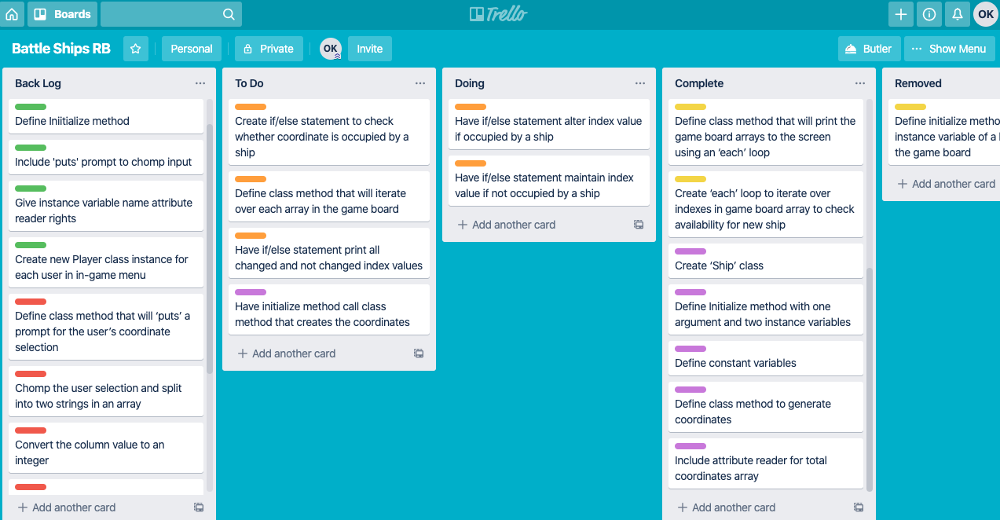
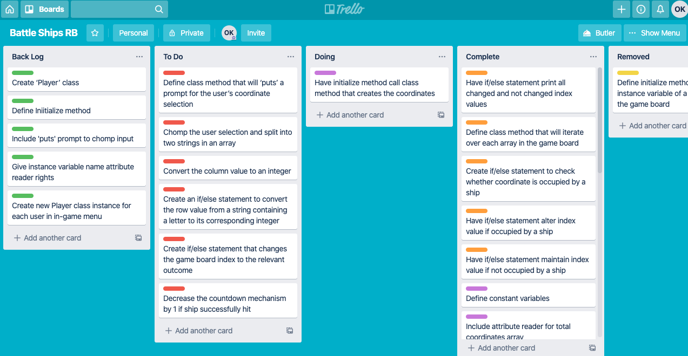
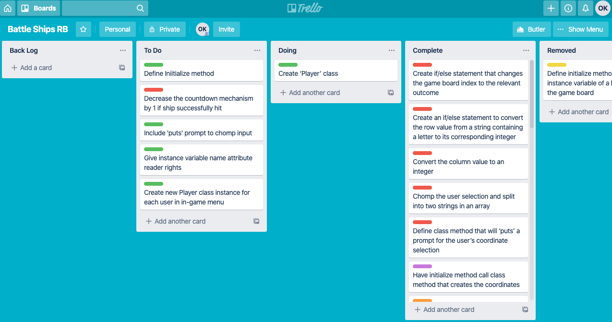
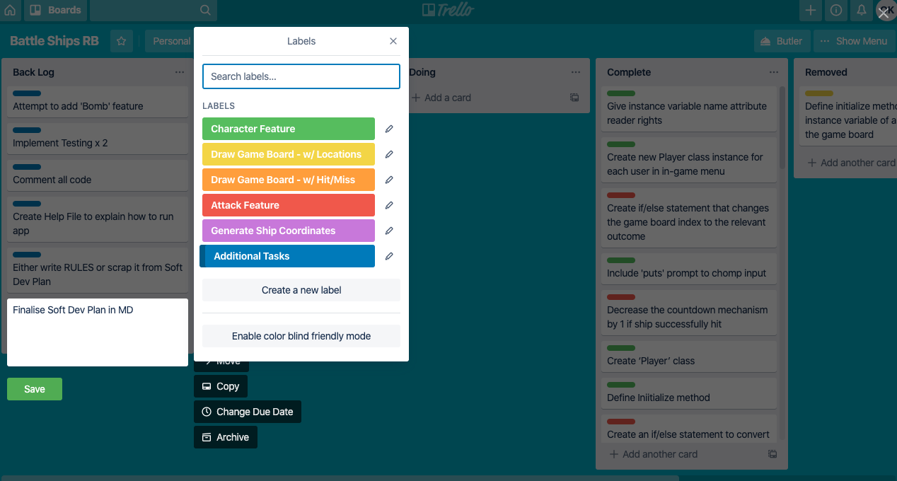
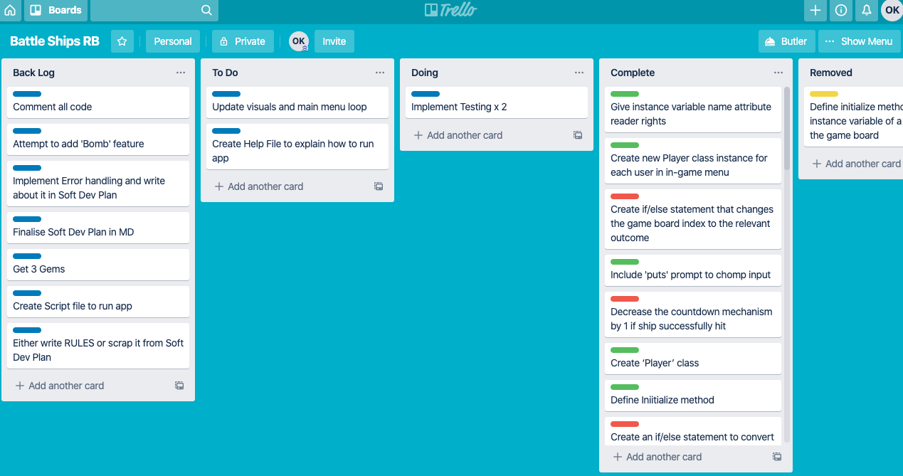
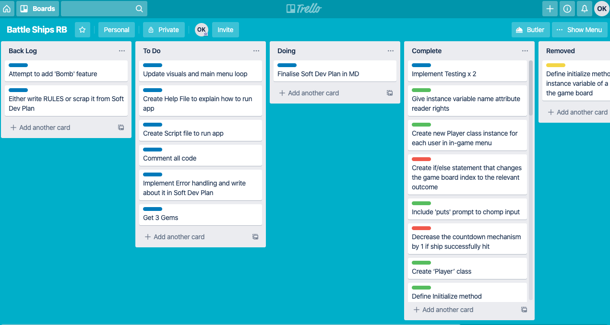
